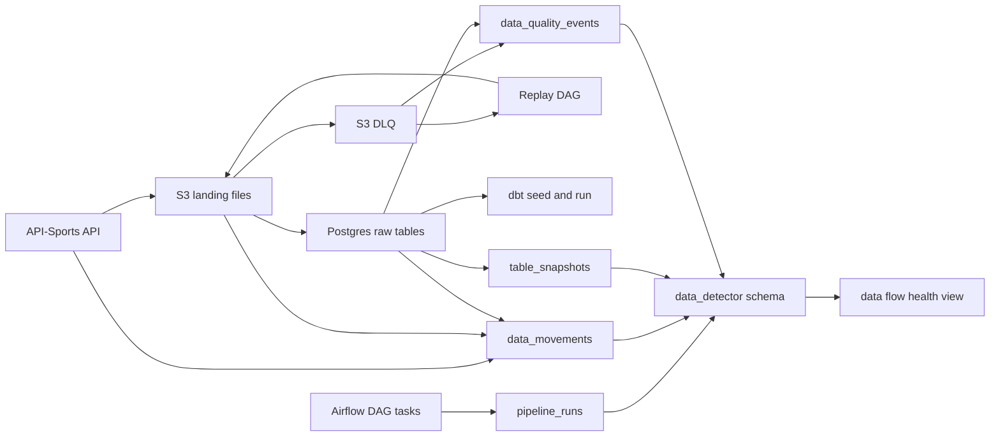

# Data Flow Detector

The `data_detector` schema tracks pipeline execution, movement between storage boundaries, raw table snapshots, and durable data quality events. It is not the source of business truth; it is the audit layer that explains what moved, what changed, and whether stored data is healthy enough to trust.

## Purpose

The pipeline moves data through four main places:

- API-Sports: source API payloads.
- S3 landing and DLQ files: immutable raw JSON payloads and failed-key recovery state.
- Postgres raw tables: structured warehouse input.
- dbt schemas: transformed tables used by analytics/API pages.

The detector records metadata about those flow points so the pipeline can answer:

- Did the expected data arrive?
- Did it load into the expected table?
- How many rows changed?
- What is the latest data timestamp?
- Did a table become stale, shrink unexpectedly, or fail to refresh?
- Is anything stuck in DLQ?

## Detector Tables

### `data_detector.pipeline_runs`

One row per tracked DAG/task execution.

Example:

| pipeline_run_id | run_id | dag_id | task_id | status | started_at | kafka_started_at | data_interval_start | error_message |
|---:|---|---|---|---|---|---|---|---|
| 1 | `scheduled__2026-05-21` | `fixture_update_dag` | `extract_updates` | `success` | `2026-05-21 07:00:00+00` | `2026-05-21 07:00:01+00` | `2026-05-20 00:00:00+00` | `NULL` |
| 2 | `scheduled__2026-05-21` | `fixture_update_dag` | `load_updates` | `success` | `2026-05-21 07:01:13+00` | `2026-05-21 07:01:14+00` | `2026-05-20 00:00:00+00` | `NULL` |
| 3 | `scheduled__2026-05-21` | `fixture_update_dag` | `run_dbt` | `failed` | `2026-05-21 07:04:00+00` | `2026-05-21 07:04:01+00` | `2026-05-20 00:00:00+00` | `relation missing` |

Use it to inspect whether pipeline tasks ran and whether a downstream data issue is caused by an execution failure.

`started_at` is the producer event time computed by the Airflow callback when the task-start event is created. `kafka_started_at` is reserved for the Kafka broker/consumer timestamp when the same event is published through Kafka. The difference between the two is detector ingestion lag.

### `data_detector.data_movements`

One row per movement across storage boundaries.

Example:

| data_movement_id | run_id | dag_id | task_id | movement_type | source_system | source_s3_key | target_schema | target_table | row_count | updated_count | failed_count | status |
|---:|---|---|---|---|---|---|---|---|---:|---:|---:|---|
| 1 | `scheduled__2026-05-21` | `fixture_update_dag` | `extract_updates` | `api_to_s3` | `api_sports` | `incremental/2026-05-21/fixtures.json` | `NULL` | `NULL` | 43 | `NULL` | 0 | `success` |
| 2 | `scheduled__2026-05-21` | `fixture_update_dag` | `load_updates` | `s3_to_raw` | `s3` | `incremental/2026-05-21/fixtures.json` | `raw` | `raw_fixtures` | 43 | 43 | 0 | `success` |
| 3 | `manual__2026-05-21` | `bootstrap_dag` | `load_fixtures` | `s3_to_raw` | `s3` | `full_load/39/2025/2026-05-21/fixtures.json` | `raw` | `raw_fixtures` | 0 | 0 | 1 | `failed` |

Use it to trace a payload from API extraction to S3 and then into Postgres.

Current implementation records:

- `api_to_s3` for bootstrap full-load fixture extraction.
- `api_to_s3` for daily incremental fixture extraction.
- `s3_to_raw` for bootstrap fixture loads.
- `s3_to_raw` for daily incremental fixture updates.
- `raw_correction` for fixture correction updates applied inside `raw.raw_fixtures`.
- `dlq_replay_to_s3` for replaying a failed league-season from API-Sports back to S3.
- `s3_to_raw` for replay loads from landing-zone S3 into raw fixtures.
- failed `api_to_s3` and `s3_to_raw` movements where the task catches and continues or writes to DLQ.

Fixture movements use `kickoff_utc` as the watermark column. `watermark_min` is the earliest kickoff in the payload and `watermark_max` is the latest kickoff in the payload. This describes the match-time coverage of the movement, while `detected_at` describes when the detector observed the movement.

### `data_detector.table_snapshots`

One row per table snapshot after important pipeline steps.

Example:

| table_snapshot_id | run_id | dag_id | table_schema | table_name | row_count | max_updated_at | max_kickoff_utc | snapshot_at |
|---:|---|---|---|---|---:|---|---|---|
| 1 | `scheduled__2026-05-21` | `fixture_update_dag` | `raw` | `raw_fixtures` | 156420 | `2026-05-21 07:01:25+00` | `2026-05-25 19:00:00+00` | `2026-05-21 07:01:26+00` |
| 2 | `scheduled__2026-05-21` | `fixture_update_dag` | `raw` | `raw_league_standings` | 482 | `2026-05-21 07:03:11+00` | `NULL` | `2026-05-21 07:03:12+00` |
| 3 | `scheduled__2026-05-22` | `fixture_update_dag` | `raw` | `raw_fixtures` | 156460 | `2026-05-22 07:01:21+00` | `2026-05-26 20:00:00+00` | `2026-05-22 07:01:22+00` |

Use it to detect stale tables, unexpected row drops, and mismatches between raw and mart freshness.

`raw.raw_fixtures` snapshots use `kickoff_utc` for `max_kickoff_utc` and `updated_at` for warehouse freshness. `raw.raw_league_standings` snapshots use `updated_at` for freshness, leave `max_kickoff_utc = NULL`, and store `leagues_updated` in `details`.

Current implementation records snapshots for:

- `raw.raw_fixtures` after bootstrap fixture loads.
- `raw.raw_fixtures` after incremental update loads.
- `raw.raw_fixtures` after replay loads.
- `raw.raw_league_standings` after standings refresh.

### `data_detector.data_quality_events`

One row per data health issue.

Example:

| data_quality_event_id | run_id | dag_id | task_id | severity | check_name | table_schema | table_name | source_s3_key | status | error_message |
|---:|---|---|---|---|---|---|---|---|---|---|
| 1 | `manual__2026-05-21` | `bootstrap_dag` | `load_fixtures` | `error` | `s3_load_failed` | `raw` | `raw_fixtures` | `full_load/39/2025/2026-05-21/fixtures.json` | `open` | `COPY failed: invalid input syntax` |
| 2 | `scheduled__2026-05-21` | `replay_dag` | `check_dlq` | `warning` | `dlq_not_empty` | `NULL` | `NULL` | `dlq/39/2025/2026-05-21/error.json` | `open` | `1 league-season remains in DLQ` |
| 3 | `scheduled__2026-05-21` | `fixture_update_dag` | `update_standings_task` | `warning` | `standings_stale` | `raw` | `raw_league_standings` | `NULL` | `open` | `standings max(updated_at) is older than expected` |

Use it as the durable alert table. Airflow logs explain what happened in a task; this table records the data health outcome.

## Detector Flow



## Operating Rules

- Record a `pipeline_runs` row for each tracked Airflow task.
- Record a `data_movements` row whenever data crosses a storage boundary.
- Record a `table_snapshots` row only for the raw tables currently monitored by the detector: `raw.raw_fixtures` and `raw.raw_league_standings`.
- Record a `data_quality_events` row for DLQ entries, failed loads, stale data, or unexpected row deltas.
- Keep detector writes best-effort but visible: if detector recording fails, log it without hiding the underlying pipeline result.

## Quality Gate

Run the local detector quality gate before changing detector contracts or DAG wiring:

```bash
scripts/quality_check.sh
```

The gate runs unit tests for `etl/src/data_detector/` and compiles the detector modules plus the tracked Airflow DAG files. It defaults `PROJECT_ROOT` to the current working directory for the compile check.

## Pipeline Run Implementation

Airflow task callbacks write `pipeline_runs` records:

- `on_execute_callback`: computes producer event time and upserts `status='running'` and `started_at`.
- `on_success_callback`: computes producer event time and updates `status='success'` and `finished_at`.
- `on_failure_callback`: computes producer event time and updates `status='failed'`, `finished_at`, and `error_message`.
- `on_skipped_callback`: computes producer event time and updates `status='skipped'` and `finished_at`.

The success callback also preserves an Airflow task instance state of `skipped` when Airflow reports that state through the callback context. This keeps no-op bootstrap days visible as skipped detector rows instead of successful work.

The detector is best-effort. If the detector schema is missing during early bootstrap, the callback logs a warning and leaves the actual pipeline task result unchanged.

When Kafka is added, Airflow should publish the same event payload to a topic such as `ballistics.pipeline.events`. The detector consumer should store the Kafka broker metadata in `kafka_started_at`, `kafka_finished_at`, `kafka_topic`, `kafka_partition`, `kafka_start_offset`, and `kafka_finish_offset`.

The producer contract is documented in `docs/producers/pipeline_run_events.md`.

The movement, snapshot, and quality contracts are documented in:

- `docs/contracts/data_movement_events.md`
- `docs/contracts/table_snapshot_events.md`
- `docs/contracts/data_quality_events.md`

## First Checks to Build

- `dlq_not_empty`: open warning when S3 DLQ contains entries after replay.
- `s3_load_failed`: open error when a fixture landing key fails to load and is sent to DLQ.
- `raw_fixture_stale`: open warning only when current league seasons exist, past unresolved fixtures exist, and `raw.raw_fixtures.max(updated_at)` is older than 26 hours.
- `standings_stale`: open warning when any current league has no standings update within 7 days. Event details include `stale_leagues`.
- `unexpected_row_drop`: error when a key table has a lower row count than its previous successful snapshot without an explicit full-refresh reason.
- `zero_update_payload`: info/warning when incremental extraction produces no updates, depending on fixture calendar context.
